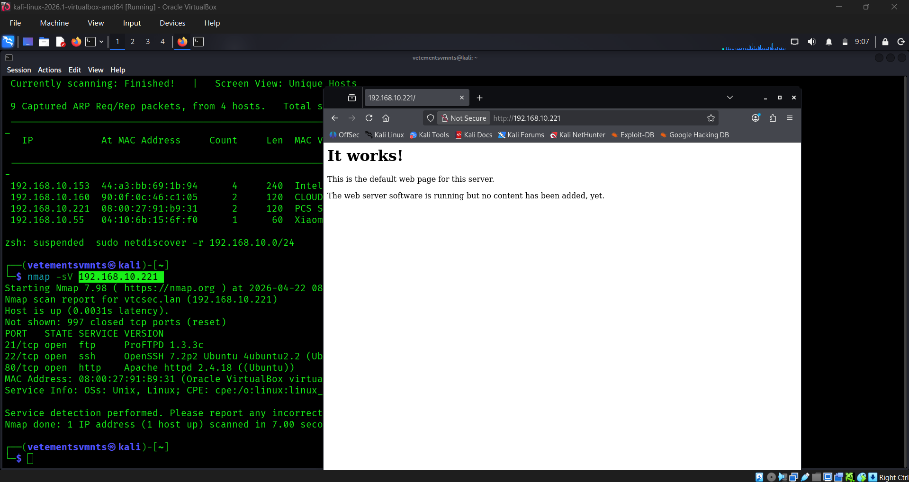

### 1. Network Discovery Results
This section shows the initial reconnaissance phase where active hosts are identified on the network using ARP requests.

 

---

### 2. Nmap Service Detection
The following output demonstrates a service version scan (`-sV`) against a specific target to identify open ports and running services.

 

---

### 3. Target System Status
This image provides a diagnostic view of the captured network traffic and system interactions during the scan.

 

---

### 4. Lab Environment Reference
Below is the reference image for the current networking lab setup.

